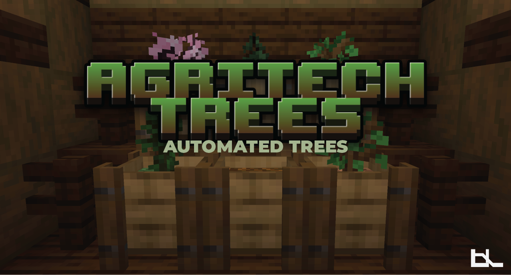

AgriTech Trees introduces customizable planters that streamline tree growing and automated harvesting.

## Features

- **Automated Tree Growth**: Plant saplings and watch them grow automatically
- **Hopping Planters**: Automatically output harvested items to containers below
- **Internal Storage**: Built-in inventory to store harvested trees
- **Wide Sapling Compatibility**: Works with vanilla saplings and many modded saplings

## Supported Saplings

AgriTech Trees supports all vanilla saplings:
- Oak, Birch, Spruce, Jungle, Dark Oak, Cherry, Azalea, Acacia, Mangrove, 
- Crimson Stem, Warped Stem

## Mod Compatibility

AgriTech integrates with:
- **Integrated Dynamics**
- **Ars Nouveau**
- **Occultism**
- **Twilight Forest (Not including magic trees)**
- **Forbidden Arcanus**
- **EvilCraft**
- **Hexerei**

## Configuration

- Enable/disable mod compatibility
- Add custom saplings and soils
- Modify growth rates and drop chances
- Customize planter behavior

Configuration is located at `config/agritechtrees/saplings_and_soil.json`

## License

All Rights Reserved